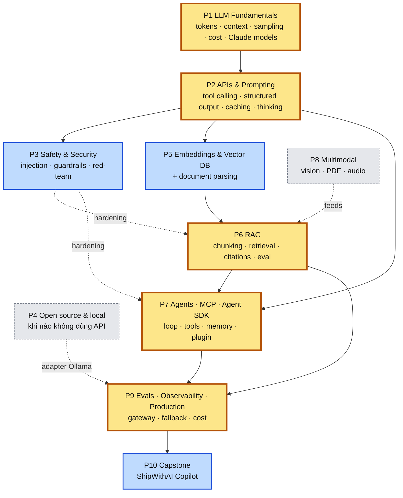
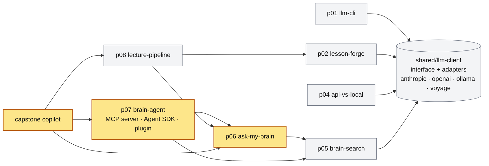
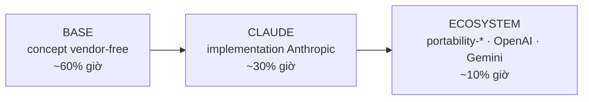

# Overview: bản đồ kiến thức

Ba câu hỏi trang này trả lời: **học cái gì trước cái gì**, **cái gì quan trọng hơn**, và **các project ghép với nhau ra sao**.

## 1. Bản đồ phụ thuộc (học cái gì trước)

Mũi tên liền = *cần có trước*. Mũi tên đứt = *bổ trợ*. Màu = mức quan trọng (xem mục 2).

Đọc nhanh: **trục chính là F → A → R → G → P**. Mọi thứ khác bám vào trục này. Nếu phải cắt, cắt các node xám trước (P4, P8), rồi rút ngắn node xanh (P5, P3) — không bao giờ cắt node vàng.

## 2. Mức quan trọng

| Tier | Phần | Vì sao | Giờ | Nếu chỉ còn 50% thời gian |
|---|---|---|---|---|
| **1 — phải master** | P7 Agents · MCP · Agent SDK | Thứ thị trường 2026 trả tiền; MCP + Agent SDK là lợi thế Claude-first rõ nhất | 36h | Giữ nguyên |
| **1** | P6 RAG | 80% ứng dụng LLM thật là RAG ở dạng nào đó; eval RAG là kỹ năng phân biệt senior | 30h | Giữ 4 tuần |
| **1** | P2 APIs & Prompting | Tool calling, structured output, caching là "ngữ pháp" của mọi thứ sau; caching = câu trả lời cost số 1 | 18h | Giữ nguyên |
| **1** | P9 Evals · Production | Phân biệt người làm demo và AI engineer; gateway abstraction là cơ chế mở rộng hệ sinh thái | 30h | Giữ 3 tuần |
| **2 — cần đủ** | P1 Fundamentals | Đủ để debug và nói chuyện cost; không cần sâu hơn | 18h | 2 tuần |
| **2** | P3 Safety | Phỏng vấn luôn hỏi injection; production bắt buộc có guardrails | 18h | 2 tuần, bỏ alignment |
| **2** | P5 Embeddings & VDB | Nền của RAG; 100% base, portable | 24h | 3 tuần, bỏ hybrid |
| **3 — biết là đủ** | P4 Open source | Chỉ để trả lời "khi nào không dùng Claude" | 12h | 1 tuần hoặc bỏ |
| **3** | P8 Multimodal | Claude vision/PDF hữu ích nhưng không phải trục chính | 12h | Gộp vào P6 1 tuần |
| — | P10 Capstone | Gộp, không học mới | 30h | 3 tuần |

## 3. Các project ghép với nhau thế nào

`shared/llm-client` là móng: mọi project gọi qua nó, không project nào import SDK vendor trực tiếp. Đây là lý do sau này đổi hệ sinh thái chỉ cần viết adapter mới.

## 4. Ba lớp trong mỗi phần

Ví dụ với RAG: `rag-citations-concept` (base) → `claude-citations-api` (claude, link về base) → `portability-openai-file-search-gemini-rag` (ecosystem). Thứ tự này là bắt buộc: không có note claude khi base chưa done.

## 5. Chủ đề xuyên suốt (không thuộc phase nào)

| Chủ đề | Xuất hiện ở | Vì sao xuyên suốt |
|---|---|---|
| **Cost** | P1 pricing → P2 caching/batch → P9 cost model | Mọi quyết định kiến trúc LLM cuối cùng là quyết định về cost |
| **Eval** | P3 red-team → P5 recall@k → P6 RAG eval → P7 agent eval → P9 eval system | Không đo được thì không cải thiện được; là kỹ năng senior nhất |
| **Security** | P3 → P6 injection qua RAG → P7 tool permissions | Bề mặt tấn công mở rộng theo từng phase |
| **Abstraction** | `llm-client` từ P0 → gateway ở P9 | Cơ chế kỹ thuật của "Claude-first, không Claude-only" |

Xem [[roadmap/README|roadmap đầy đủ]] · [[plan/weeks|bảng tuần]] · [[index|hub]]
