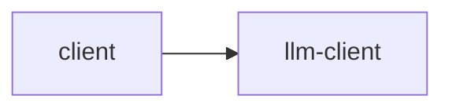

# Capstone — ShipWithAI Copilot

## Problem

## Architecture (Mermaid)

```mermaid
flowchart LR
  A[client] --> B[llm-client]
```

## Trade-offs

## Eval / numbers

## Notes applied

## What I'd do differently
